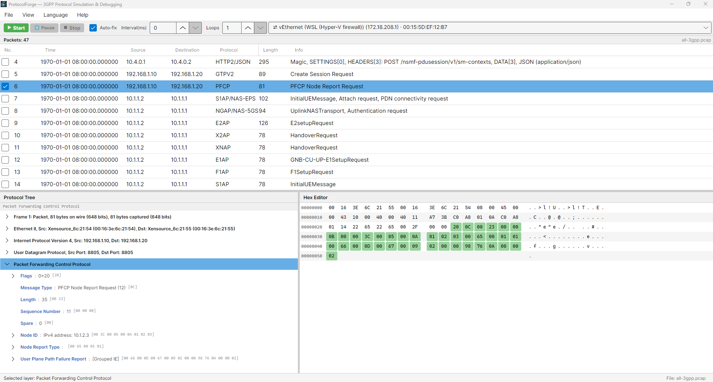
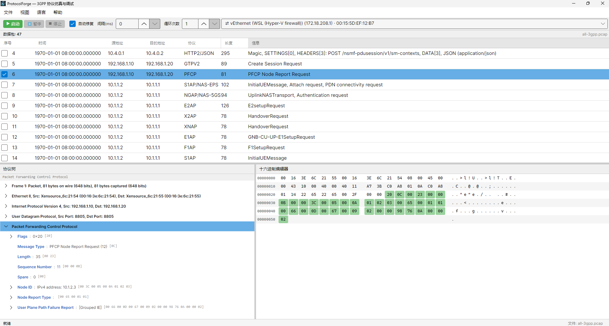

# ProtocolForge

**3GPP 协议仿真与调试工作台**

ProtocolForge 是一款跨平台桌面应用程序，用于检查、编辑和重放 PCAP 文件中捕获的 3GPP 协议报文（PFCP、NGAP、GTP-U、NAS、S1AP、Diameter 等）。它将 Wireshark 的解析引擎（tshark）与原生的报文编辑器和裸套接字注入结合于一个 .NET 8 + Avalonia UI 应用中。

> **免费开源（Apache-2.0）。** 当前已交付的功能全部免费且无上限 —— 没有功能门禁、没有发送配额、没有遥测。Windows 上请自行安装 Wireshark，并在安装时保留 Npcap 选项（默认勾选）；ProtocolForge 不捆绑、不静默安装 Npcap。

**为什么不用 Wireshark？** Wireshark 的解析能力极强，但改完一个字段后无法把帧原样放回链路。Scapy、Ostinato 这类脚本工具能改能发，却没有 GUI。商用 3GPP 测试设备两件事都能做，代价是五位数的硬件。ProtocolForge 补的正是这个空档：Wireshark 的解析引擎 + 带「验证后提交」的原生十六进制/字段编辑器 + 多层注入阶梯，集成在一个桌面应用里。差异点在于**在真实运营商报文上「改完再注入」**，这正是 Wireshark 和脚本工具都覆盖不到的。

**面向谁。** 3GPP 协议工程师、RAN/核心网测试工程师，以及在自有实验网络上验证 UE/eNB/核心网互操作的科研人员。

> ⚠️ **报文注入会向网络发送真实帧。** 请仅在你拥有或已获得书面授权的网络上使用 ProtocolForge。发送行为可能违反当地法律或运营商条款，责任完全由使用者承担。ProtocolForge 不包含规避检测、获取凭据或针对生产环境的载荷模糊测试工具。完整能力清单与使用声明见 [`SECURITY.md`](SECURITY.md)。


## 界面截图

打开一份合成抓包，并选中一条 PFCP Association Setup Response。协议树已展开到解析后的 PFCP AVP，
十六进制编辑器高亮显示树中聚焦字段所占的字节。



同一界面的简体中文版本 —— 界面完整提供中英双语，并支持运行时切换。



两张图片均由 [`docs/make-synthetic-capture.py`](docs/make-synthetic-capture.py) 生成的合成抓包渲染，
不涉及任何真实运营商抓包，也不需要提交真实抓包即可复现。

---

## 功能特性

- **PCAP 读取** — 使用原生 C# 解析器读取 PCAP 与 PCAPNG 文件（支持微秒和纳秒时间戳格式）；同时支持大小端经典 PCAP 以及 PCAPNG 的 section/interface/packet 块，并按接口解析时间戳分辨率。
- **Tshark 集成** — 双模式使用 tshark：一次流式 `-T fields` 传递填充报文列表（Source/Destination/Protocol/Info 列，在 tshark 解析过程中逐步填充）；协议详情树仅在选中报文时按需解析（`-T jsonraw`/`json`/`pdml`，字节偏移精确）。支持 Wireshark 能解析的所有协议（PFCP、NGAP、GTP-U、NAS、S1AP、HTTP/2、Diameter、SCTP 等）。
- **Tshark 环境门禁** — 启动时及路径更改后，会检查已安装 tshark 的版本，最低要求 2.6.0。若 tshark 缺失或版本过低，应用仍可打开抓包文件，但进入**只读模式**：显示警告横幅，原始报文数据正常加载（地址等列显示为 `N/A`），但树/十六进制编辑、导出和报文注入均被禁用。可通过 **文件 → Tshark Path…** 在运行时重新选择 tshark 路径，找到有效 tshark 后会重新检测并解除门禁。所选路径会被持久化（也可用 `TSHARK_PATH` 环境变量覆盖）。
- **双语界面（简体中文 / English）** — 全界面本地化，通过 **语言 / Language** 菜单（位于 View 与 Help 之间）即时切换语言，无需重启；语言偏好会被持久化，首次运行时自动检测系统区域设置。
- **三遍式 jsonraw 解析器** — 仅遍历*选中报文*的 JSON 结构（而非整个文件）：
  1. 收集所有 `_raw` 数组（十六进制值、偏移量、长度）
  2. 处理 `_tree` 容器和子对象，递归构建字段嵌套
  3. 处理孤立的 `_raw` 条目（如没有 `_tree` 父级的 `ip.src_raw`）
- **十六进制查看器 + 内联编辑** — Wireshark 风格的十六进制转储：每行 16 字节，含偏移列、十六进制（8+8 分组）和 ASCII 面板。单击单元格或使用方向键导航；选中的字节显示为深蓝色，协议字段范围以协议特有的颜色高亮，通过协议树或十六进制编辑器修改过的字节以橙色标记。字节也可以**直接在十六进制面板中编辑**：在任意字节上开始输入十六进制字符（0-9/A-F 或小键盘），待定值会就地预览（黄色背景、灰色 ASCII），按 Enter 将整段作为一次替换提交，按 Esc 取消。编辑是**仅替换（REPLACE-only）**的 — 每一段都由完整的十六进制数字对组成，因此报文长度永远不会改变，编辑跨度之外的偏移始终有效。
- **树 ↔ 十六进制双向同步** — 点击协议树中的字段会在十六进制查看器中高亮其字节范围。反之，在十六进制面板中选择/编辑字节会解析出所属字段，并在树中滚动并选中对应节点（`FieldFoundAtOffset` → 树定位展开）。
- **协议树** — 已解析信息元素的分层树视图。点击任意字段可在十六进制查看器中高亮其字节范围。右键单击字段（或双击它）可打开内联值编辑器：以自然形式输入值（十进制、点分 IP、MAC、字符串或十六进制），按 Enter（或单击其他位置）应用，按 Esc 取消。编辑受**编辑栅栏**（`CheckTreeEditFence`）限制 — 六个检查须全部通过字段才可编辑：可解析的字段类型、非负字节跨度、字节对齐（非位级子字段）、位于帧内（指向重组 PDU 的跨度则失败）、具体的字节证据（`RawBytes.Length` 与字段长度一致）、记录字节与实际帧字节一致（能捕获掩码/偏移漂移值）。被阻断的字段会在状态区显示原因（`Not editable: …`）并拒绝打开编辑器。
- **验证后提交（VBC）** — 同时适用于树和十六进制编辑。提议的编辑不会直接写入报文：先将候选帧保存到临时 PCAP（有上下文帧时附带），**经 tshark 重新解析**，字段的新十六进制值必须落在预期的 `(PDML 名称, 字节偏移)` 位置。偏移漂移、值不匹配或长度变更都会中止提交并给出原因，报文保持逐字节不变。
- **容器自动联动** — 提交的字段编辑完成后，后台重新解析编辑过的报文（单包 PDML 重解析），并就地回填协议树的容器/层头文本，例如编辑 PFCP SEID 后，周围的 `F-SEID : SEID: 0x…, IPv4 …` 显示会立即刷新，无需重建树。按 PDML 名称 + 字节偏移匹配字段，匿名 IE 容器回退到有效（最小后代）偏移。
- **十六进制原生字段编辑** — Wireshark 以十六进制渲染的字段（PFCP SEID/TEID、地址范围等）会自动从 PDML showname（`0x…` 前缀）检测，并默认按十六进制编辑，按大端逐字节精确往返，与 tshark 显示完全一致。
- **地址/端口重新提取** — 字节编辑后，自动从修改后的字节重新解析 IP 地址和端口号，并反映在报文列表列中。
- **报文 DataGrid** — 报文列表是可排序的 DataGrid：单击任意列头可在升序/降序间循环，双击列头分隔线可自适应该列宽度（所有列均支持）。
- **选择性发送** — 每包复选框 + 右键上下文菜单（全选 / 反选 / 清除 / 仅发送选中）精确控制注入哪些报文。
- **PCAP 导出** — 将修改后的报文保存回标准 PCAP 格式。支持覆盖保存（Ctrl+S）和另存为（Ctrl+Shift+S）。跟踪未保存的更改并在关闭时提醒。
- **报文注入** — 通过探测并逐级回退的发送档位（rung）阶梯，在选定的网络接口上发送报文：
  0. **Npcap / BPF**（Windows / macOS，可选项）— 原生 L2 路径可用时发送完整的以太网帧；不可用时静默跳过
  1. **AF_PACKET 原始套接字**（Linux）— 完整的以太网帧
  2. **IP 原始套接字**（Windows/Linux/macOS）— IP 数据报
  3. **UDP 套接字** — 传输层回退（无需特权）
  发送由可配置的**发送间隔（毫秒）**和**循环次数**驱动。**Auto-fix** 开关会在注入前修复 IPv4/IPv6 与 TCP/UDP 校验和，并将源地址改写为所选接口自身的地址。
- **工具栏 UI** — 开始/暂停/停止发送控制、网络适配器下拉菜单、发送间隔与循环次数输入框、Auto-fix 开关、实时发送/失败计数器和状态栏。
- **布局持久化** — 窗口几何位置、分隔条位置和面板可见性保存到 `%APPDATA%/ProtocolForge/layout.json`，下次启动时恢复。

---

## 架构

```
┌────────────────────────────────────────────────────────┐
│                    MainWindow                           │
│  ┌───────────────┬────────────────┬──────────────────┐  │
│  │   报文列表      │   协议树        │  十六进制查看器   │  │
│  │  (DataGrid)    │  (TreeView)    │   (Custom)        │  │
│  └───────┬───────┴───────┬────────┴──────┬───────────┘  │
│          │               │               │              │
│  ┌───────▼───────────────▼───────────────▼───────────┐  │
│  │           MainWindowViewModel                     │  │
│  │  PacketList │ ProtocolTree │ HexEditor │ ToolBar  │  │
│  └───────┬───────────┬───────────┬──────────┬───────┘  │
│          │           │           │          │          │
└──────────┼───────────┼───────────┼──────────┼──────────┘
           │           │           │          │
     ┌─────▼───┐ ┌────▼────┐ ┌───▼────┐ ┌───▼────────────┐
     │Tshark   │ │Protocol  │ │Pcap    │ │NetworkInterf.  │
     │Service  │ │Editor    │ │Export  │ │PacketSend      │
     └─────────┘ └─────────┘ └────────┘ └────────────────┘
```

### 设计原则

- **MVVM + 手动依赖注入** — 无外部 IoC 容器。服务在 `App.axaml.cs` 中按依赖顺序实例化。ViewModel 通过构造函数参数接收依赖。
- **零原生依赖** — 纯 C#，无捆绑的原生库。唯一的例外是*可选*的 L2 路径：Windows 上探测用户已安装的 Npcap（`wpcap.dll`，P/Invoke），macOS 上探测 `/dev/bpfN` — 原生路径存在时提供完整 L2 注入，否则发送静默降级为纯托管套接字。唯一的外部依赖是协议解析所需的 **tshark**（来自 Wireshark）。
- **跨平台** — 目标 net8.0，可在 Windows、Linux 和 macOS 上运行。Socket 策略根据操作系统自动调整。
- **最小耦合** — 服务独立；ViewModel 之间通过事件通信（`PacketSelected`、`FieldSelected`、`FieldEdited`、`LayerSelected`、`HexEdited`、`FieldFoundAtOffset`）。

---

## 项目结构

```
ProtocolForge/
├── App.axaml.cs              # 应用入口 — 手动 DI 组合
├── Program.cs                 # Avalonia 启动
├── ProtocolForge.csproj       # .NET 8, Avalonia 12.0.5, CommunityToolkit.Mvvm 8.4.2, DataGrid 12.0.1
│
├── Assets/Lang/               # 本地化字典 — en-US.json + zh-CN.json（作为嵌入资源）
│   ├── en-US.json            # 英文界面字符串（148 个键）
│   └── zh-CN.json            # 简体中文界面字符串（148 个键，键集一致）
│
├── Models/                    # 领域对象
│   ├── Packet.cs              # 单个报文：原始数据、修改、地址/端口、协议层
│   ├── PacketDocument.cs      # PCAP 文档：报文集合、脏状态跟踪
│   ├── HexByte.cs             # 十六进制查看器中的字节：值、选择、高亮、已修改标记、待编辑状态
│   ├── ProtocolField.cs       # 协议信息元素：偏移量、长度、原始字节、子字段、PDML 名称/hex 偏好（用于重新联动）
│   ├── ProtocolLayer.cs       # 协议层容器
│   ├── PacketExportOptions.cs # 导出配置
│   └── TsharkJsonModels.cs    # JSON 反序列化模型（历史遗留，大部分解析为手动）
│
├── Services/                  # 业务逻辑
│   ├── TsharkService.cs       # 流式 `-T fields` 列表加载 + 按报文按需 jsonraw/json/pdml 建树 + 单包 pdml 重解析 + tshark 检测/版本门禁
│   ├── EditTransactionService.cs # 验证后提交：候选帧 → tshark 重解析 → (名称, 偏移) 十六进制校验 → 提交或中止
│   ├── TsharkSettingsService.cs # 跨会话持久化用户选择的 tshark 路径和界面语言（settings.json）
│   ├── LocalizationService.cs # 运行时本地化核心：Resolve(key, args)、SetCurrent(AppLanguage)、LanguageChanged 事件、DynamicResource 发布
│   ├── PcapIngestService.cs   # 原始 PCAP 字节读取器（处理字节序、µs/ns 时间戳）
│   ├── PcapExportService.cs   # PCAP 写入器 — 覆盖保存、另存为、单包重解析临时文件
│   ├── ProtocolEditorService.cs # 编辑栅栏（CheckTreeEditFence）、字段级编辑、偏移量查找、十六进制↔字节转换
│   ├── LayoutService.cs       # 窗口布局持久化（JSON 保存在 %APPDATA%）
│   ├── NetworkInterfaceService.cs  # 跨平台网络适配器扫描器
│   ├── PacketContextProvider.cs # tshark 域内上下文扫描（SDP、IP 分片、TCP 重传），按需惰性执行
│   ├── PacketSendService.cs   # 原始报文注入，带发送档位（rung）阶梯回退（L2 → IP → UDP）
│   ├── PacketPrepareService.cs # 发送前准备：校验和/长度修复、源地址注入
│   ├── IL2SendRung.cs         # 原生 L2 发送者契约（Windows Npcap / macOS BPF）
│   ├── NpcapSendService.cs    # Windows L2 档位 — 探测用户安装的 wpcap.dll，按 GUID 匹配发送设备
│   ├── BpfSendService.cs      # macOS L2 档位 — 探测 /dev/bpfN，BIOCSETIF 绑定，header-complete 写入
│   └── TraceLog.cs            # 轻量运行时追踪日志（LocalApplicationData/ProtocolForge/logs 下的 trace.log）
│
├── ViewModels/                # MVVM ViewModel
│   ├── MainWindowViewModel.cs # 协调器：命令（打开/保存/导出）、跨面板连线、只读状态传播、hex↔树同步
│   ├── PacketListViewModel.cs # 报文选择、文档绑定
│   ├── ProtocolTreeViewModel.cs # 协议层/字段树、字段点击 → 十六进制高亮、内联值编辑（Enter/Esc/点击外部）、VBC 提交、为 hex 选择定位树节点
│   ├── HexEditorViewModel.cs  # 十六进制渲染 + 仅替换（REPLACE-only）内联编辑、选择/高亮、已修改字节标记、反向同步事件
│   ├── ToolBarViewModel.cs    # 开始/暂停/停止发送命令、间隔/循环、接口下拉菜单
│   └── ViewModelBase.cs       # 公共 ObservableObject 基类
│
├── Views/                     # Avalonia XAML + 代码后置
│   ├── MainWindow.axaml       # 完整窗口布局：菜单、工具栏、报文列表、分隔条、协议树、十六进制
│   ├── MainWindow.axaml.cs    # 文件对话框、布局恢复/保存、菜单处理
│   └── Controls/
│       ├── HexEditor.axaml.cs # 自定义十六进制查看器：16字节行、点击/键盘导航、视觉状态
│       ├── HexEditor.axaml    # 极简 XAML — 所有内容在代码后置中构建
│       ├── ProtocolTreeView.axaml  # 带字段数据模板的 TreeView
│       ├── ProtocolTreeView.axaml.cs # 点击/双击/右键菜单处理：选择与内联编辑
│       └── DoubleClickAutoFit.cs  # 双击列分隔线 → 列宽自适应（附加行为）
│
├── Converters/                # XAML 值转换器
│   ├── HexByteColorConverter.cs    # 字节背景多值转换器（选中/高亮/已修改）
│   └── BoolToStringConverter.cs    # 暂停/继续按钮文字
│
└── ViewLocator.cs             # 基于约定的 View → ViewModel 解析
```

`tests/pf-verify/` 下有一个独立的验证 harness（独立控制台项目，引用 `ProtocolForge`）。它针对一份示例抓包（通过 `PF_CAPTURE` 指定；抓包缺失时相关分组会被跳过而非失败）驱动运行时服务层 — 对固定帧的编辑栅栏裁决、验证后提交（VBC）的合法/非法场景（提交、偏移漂移中止、长度变更拒绝、逐字节不变保证）、tshark 版本门禁（真实环境 + 通过 `TSHARK_PATH` 注入伪造过低/达标二进制）、只读加载、十六进制编辑的代码面检查以及本地化字典检查（GROUP 11）。运行方式：`dotnet run --project tests/pf-verify`。注意这里有两个不同的 tshark 下限：**应用**门禁是 tshark >= 2.6.0，而**验证 harness** 需要 tshark >= 3.6.2 才能全绿。没有抓包夹具时有 6 个分组会被跳过，而 harness 仍会输出 `ALL GROUPS PASS` —— 在把一次绿灯当成完整覆盖之前，请先读 [`CONTRIBUTING.md`](CONTRIBUTING.md)。

---

## Tshark 集成（流式列表 + 按需树）

加载抓包分为两个阶段，即使是大型文件（18 万+ 报文）也能在数秒内打开，而不是几分钟。两个阶段之前都有一道**版本门禁**：启动时及路径更改后，`TsharkService.DetectTshark()` 运行 `tshark -v` 并将解析出的版本与 2.6.0 比较。若检查失败，应用进入只读模式（横幅 + 编辑器禁用）；若通过，则正常开放编辑功能。

### 阶段 1 — 报文列表：单次流式 `-T fields` 传递

1. `PcapIngestService` 用原生解析器读取 PCAP/PCAPNG 头部和原始报文字节（快速，不依赖 tshark）。
2. `TsharkService.LoadPcapAsync()` 随后运行**单条** `tshark -T fields` 进程并逐行流式读取输出：
   `-e frame.number -e _ws.col.Source -e _ws.col.Destination -e _ws.col.Protocol -e _ws.col.Info`
   每行按制表符拆分（最多 5 段——Info 列本身可能含制表符），边到边地追加到文档的报文集合，因此 DataGrid 渐进式填充，UI 保持响应。
3. 每 500 个报文报告一次进度（`0.05 + 0.9·count/total`）；tshark 输出的帧号用于对齐原生读取的报文，容忍跳帧/坏包。

### 阶段 2 — 协议树：按报文、按需构建

协议树不再针对整个文件构建。选中报文时：

1. `PcapExportService.SavePacketAsync()` 将**那一个报文**（使用其有效字节，含可能的编辑结果）写入临时 PCAP。
2. `TsharkService.BuildPacketTreeAsync()` 在该临时文件上**并行**运行 `-T jsonraw`、`-T json` 和 `-T pdml`（每包约 0.4 秒）。
3. 三遍式 jsonraw 解析器将结果合并到报文的 `Layers`；`ExtractAddressInfo()` 从解析后的字段更新地址/端口列。
4. 每次选择的序列号守卫（`_treeBuildSeq`）丢弃过期结果——如果用户在构建进行中点击了另一个报文。

单个报文的 `-T jsonraw` 输出格式如下：

```json
{
  "_source": {
    "layers": {
      "ip": {
        "ip.src_raw": ["ac1583a8", 26, 4, 0, 1],
        "ip.src_tree": { ... },
        "ip.dst_raw": ["ac1583a8", 30, 4, 0, 1]
      }
    }
  }
}
```

核心 jsonraw 解析器（`TsharkService.ParseJsonrawObject()`）分三遍处理原始 JSON：

| 遍次 | 操作 | 目的 |
|------|------|------|
| **1** | 将所有 `*_raw` 数组收集到字典中 | 按基础字段名索引原始字节信息（十六进制值、偏移量、长度） |
| **2** | 递归处理 `*_tree` 对象和嵌套子对象 | 构建层次化的协议字段树；从第1遍附加原始信息 |
| **3** | 处理孤立的 `_raw` 条目 | 类似 `ip.src_raw` 这样没有 `_tree` 父级的字段也会生成 `ProtocolField` 条目 |

地址和端口提取在按需建树过程中执行：`ExtractAddressInfo()` 扫描所选报文已解析字段中的 `src`/`dst` IP 地址和 `srcport`/`dstport` 端口号，将十六进制转换为人类可读形式，并刷新报文列表列。

### 编辑后刷新（单包重解析 + 验证后提交）

树和十六进制编辑都经由 `EditTransactionService`（验证后提交）执行：

1. `PcapExportService.SavePacketAsync()` 将单个修改后的报文写入临时 PCAP（当报文需要 SDP/IP 分片上下文才能正确解析时，附带周围上下文帧）
2. `TsharkService.ReparseSinglePacketAsync()` 对该临时文件运行 tshark `-T pdml`，收集 `(字段名, 字节偏移) → showname` 及原始值查找表
3. 提交前，重解析必须证明**新值落在预期的位置** — 偏移漂移、值不匹配或长度变更都会中止事务，报文保持逐字节不变
4. 成功后，`ProtocolTreeViewModel.RefreshFieldDisplays()` 就地遍历现有树，用新的 PDML 文本修补每个字段的 Name/DisplayValue

这样可以保持树的稳定性（保留选择、展开状态），同时显示的文本跟上已编辑的字节。匿名 IE 容器 — tshark 以 `<field name="" show="…">` 输出的 PFCP/NGAP IE，其渲染文本（如 `F-SEID : SEID: 0x…, IPv4 …`）会随子字段字节变化 — 仅按偏移匹配（空名称键），因此 SEID 编辑会传播到周围的容器显示，而无需改动树结构。

---

## 报文注入策略

`PacketSendService` 每会话探测一次原生 L2 档位（Windows 为 Npcap，macOS 为 BPF），然后按顺序尝试可用的发送档位，档位无法送达时逐级回退：

```
┌────────────────────────────────────────────────────┐
│              发送档位（Rung）策略                    │
├────────────────────────────────────────────────────┤
│ 0. Npcap（Windows）/ BPF（macOS）可选项             │
│    → 发送完整的以太网帧                             │
│    → Npcap：调用用户已安装的 wpcap.dll              │
│    → BPF：/dev/bpfN，需要 root 权限                 │
│    → 原生路径不可用时静默跳过；                     │
│    → Npcap 是 Windows 上唯一可发送 TCP 的路径       │
├────────────────────────────────────────────────────┤
│ 1. AF_PACKET 原始套接字（仅 Linux）                  │
│    → 发送完整的以太网帧                              │
│    → 需要 CAP_NET_RAW / root 权限                   │
├────────────────────────────────────────────────────┤
│ 2. IP 原始套接字（跨平台）                            │
│    → 发送 IP 数据报                                 │
│    → 需要管理员/root 权限                            │
├────────────────────────────────────────────────────┤
│ 3. UDP 套接字（始终可用）                            │
│    → 仅发送 UDP 负载                                │
│    → 无需特权                                       │
│    → 从 IP 报头提取目标地址                          │
└────────────────────────────────────────────────────┘
```

原生 L2 档位从不捆绑或静默安装：Windows 上应用只探测用户已安装的 Npcap（依据 Npcap 免费 SDK 许可条款），macOS 上只尝试打开已有的 `/dev/bpfN` 设备。探测失败时由套接字阶梯接管 — 缺少 DLL、无 root 权限、访问被拒或无匹配设备均产生与之前完全一致的纯托管行为。逐包来看，无法送达的档位（例如裸 IP 数据报没有以太网帧）会下降到下一档；L2 失败也不例外。使用 UDP 回退时，服务从原始报文的 IP/UDP 报头中提取目标 IP 和端口，仅发送负载 — 会丢失外层报头，但无需特权即可工作。

---

## 快速开始

### 前置条件

> **最终用户**：下载**自包含**发布包即可——.NET 8 运行时已捆绑，你什么都不用装，只需装 Wireshark（见下）。无需单独安装 .NET。
- **Wireshark / tshark（≥ 2.6.0）** — 协议解析需要 tshark 2.6.0 或更新版本位于 PATH（或通过 `TSHARK_PATH` 指定）。更旧的 tshark 版本会使应用以只读模式打开。从 [wireshark.org](https://www.wireshark.org/download.html) 下载。
  - Linux: `sudo apt install tshark`
  - macOS: `brew install wireshark`
  - Windows 10/11 x64：安装 Wireshark；保留 Npcap 选项（默认勾选）。应用不捆绑 Npcap。
- **.NET 8 SDK**（8.0.421 或更新版本，**仅构建/贡献者需要**）——仅编译源码时需要；运行自包含构建产物则不需要。

### 构建和运行

```bash
# 在仓库根目录执行
dotnet build ProtocolForge.sln

# 运行
dotnet run --project ProtocolForge/ProtocolForge.csproj

# 通过命令行打开 PCAP
dotnet run --project ProtocolForge/ProtocolForge.csproj -- path/to/capture.pcap

# 运行验证程序集（需 tshark >= 3.6.2 才能全过；应用本身只需 >= 2.6.0）
dotnet run --project tests/pf-verify/PfVerify.csproj
```

### 首次使用

1. 启动应用程序
2. 使用 **文件 → 打开 PCAP**（Ctrl+O）加载 `.pcap` 文件
3. 单击报文列表中的报文以检查其协议树和十六进制字节
4. 在任一面板中编辑报文内容：
   - **协议树**：右键单击可编辑字段（或双击它）并输入新值 — 十进制、IP/MAC、字符串或 `0x…` 十六进制；按 Enter 应用，按 Esc 取消。未通过编辑栅栏的字段会显示 `Not editable: …` 并拒绝打开编辑器。
   - **十六进制查看器**：单击一个字节偏移，然后输入十六进制字符（0-9/A-F/小键盘）开始替换段；待定值以黄色预览，按 Enter 一次性提交整段，按 Esc 取消。
   两条路径都会执行验证后提交（VBC）重解析 — 未正确落位的提交编辑会被拒绝。修改过的字节在十六进制查看器中以橙色标记。
5. 使用 **文件 → 保存 PCAP**（Ctrl+S）或 **导出 PCAP 另存为**（Ctrl+Shift+S）保存修改
6. 勾选要发送的报文（每包复选框，或使用报文列表的右键上下文菜单），选择网卡并设置间隔和循环次数。点击 **开始** 即直接通过所选物理网卡发送；自动修复默认关闭，只影响发送前的报文处理。

> 如果 tshark 缺失或低于 2.6.0，会显示横幅，应用以只读模式运行：报文可加载，但树/十六进制编辑器、导出和发送均被禁用，直到通过 **文件 → Tshark Path…** 配置了有效的 tshark。

### 环境变量

| 变量 | 用途 |
|------|------|
| `TSHARK_PATH` | 覆盖 tshark 可执行文件路径（自动检测会回退到 PATH 和常见安装路径）。通过 **文件 → Tshark Path…** 选择的路径也会跨会话持久化。 |

### CI 与发布制品

- GitHub Actions：`.github/workflows/ci.yml`
- 该工作流启用 warnings-as-errors、运行 `pf-verify`、拒绝新增或修改 `.pcap`/`.pcapng`，输出 Windows x64 制品，并构建 Linux x64 多文件安装包。
- Linux 制品由 [`packaging/linux/publish-linux.sh`](packaging/linux/publish-linux.sh) 生成：
  - `ProtocolForge-<version>-linux-x86_64.AppImage`
  - `protocolforge_<version>_amd64.deb`
  - `SHA256SUMS`
- Linux 发布明确使用多文件（`PublishSingleFile=false`）；AppImage 只对客户隐藏内部多文件结构。
- 本地构建 Linux 安装包：

```bash
./packaging/linux/publish-linux.sh
```

- Windows 多文件安装包由 Windows 上的 [`packaging/windows/publish-windows.ps1`](packaging/windows/publish-windows.ps1) 或 Linux CI 上的 [`publish-windows.sh`](packaging/windows/publish-windows.sh) 生成，输出 `ProtocolForge-<version>-win-x86_64.zip` 和 `SHA256SUMS`。
- 本地 Windows PowerShell 构建：

```powershell
./packaging/windows/publish-windows.ps1
```

- 打包脚本默认随包发布**未混淆**程序集。若你自行产出了混淆后的 `ProtocolForge.dll`，把打包脚本指向它即可——AppImage、deb 与 Windows ZIP 会内嵌该程序集（可用打包脚本打印的 md5 与你提供的文件比对核验）：

```bash
OBFUSCATED_DLL=/path/to/ProtocolForge.dll ./packaging/linux/publish-linux.sh
OBFUSCATED_DLL=/path/to/ProtocolForge.dll ./packaging/windows/publish-windows.sh
```

只混淆本产品程序集，并保留公开类型/成员名称——XAML 绑定、`ViewLocator` 反射与 JSON 持久化都在运行时按名称解析成员，改名会导致绑定失败。`OBFUSCATED_DLL` 指向不存在的文件时构建会失败，而不是静默产出未混淆包。CI 不设置该变量，因此流水线产物保持未混淆。

真实抓包只保留在本机。CI、测试、截图和营销材料使用生成的测试夹具；任何真实抓包必须先完成脱敏才能外发。

---

## 二次开发指南

### 添加新的协议解析器

ProtocolForge 不内置协议解析器 — 完全依赖 tshark。要支持新协议：

1. 确保 tshark 有该协议的解析器（大多数 3GPP 协议在较新版本的 Wireshark 中都支持）
2. 三遍 jsonraw 解析器会自动处理 tshark 输出的任何协议
3. 如需自定义高亮色：在 `HexEditorViewModel.GetHighlightColor()` 中为该协议名添加颜色条目

### 添加新服务

1. 在 `Services/` 中创建服务类
2. 在 `App.axaml.cs` 中以正确的依赖顺序实例化
3. 通过构造函数参数注入到相关的 ViewModel 中
4. 在 ViewModel 构造函数中注册事件处理

### 本地化新字符串

所有用户可见字符串都已外部化到 `Assets/Lang/` 中的本地化字典。要本地化新字符串，请将键同时添加到 `en-US.json` 和 `zh-CN.json`（键名一致、占位符数量一致），然后在 XAML 中以 `{DynamicResource L10n.Key}` 引用，或在 C# 中以 `LocalizationService.Resolve("Key", args…)` 引用。通过 **语言 / Language** 菜单切换语言无需额外接线 — `SetCurrent` 会自动持久化选择。

### 添加新的 ViewModel

1. 继承 `ObservableObject`（来自 CommunityToolkit.Mvvm）
2. 使用 `[ObservableProperty]` 声明可绑定属性
3. 使用 `[RelayCommand]` 声明命令
4. 在现有 ViewModel 上暴露为公共属性，或在 DI 中注册
5. 创建对应的 View XAML 控件（按约定 `FooViewModel` → `FooView`）

### 跨平台注意事项

- **文件路径**：使用 `Path.Combine()` 和 `Environment.GetFolderPath(SpecialFolder.ApplicationData)` — 切勿硬编码路径。
- **网络接口**：`NetworkInterfaceService` 使用 `System.Net.NetworkInformation`，完全跨平台。
- **Socket 类型**：`PacketSendService` 使用 `OperatingSystem.IsLinux()` 选择 AF_PACKET，并用 `OperatingSystem.IsMacOS()` 探测 `/dev/bpfN` 的 L2 路径；IP 原始套接字在 Windows、Linux 和 macOS 上均可使用。
- **条件编译**：尽量减少使用 — 仅在使用 `OperatingSystem.IsWindows()`/`IsLinux()` 运行时检查。

### 追踪日志

运行时诊断信息写入本地应用数据目录下的 `trace.log`（Windows 下为 `%LOCALAPPDATA%/ProtocolForge/logs/trace.log`，Linux 下为 `~/.local/share/ProtocolForge/logs/trace.log`，macOS 下为 `~/Library/Application Support/ProtocolForge/logs/trace.log`）。它记录报文加载、选择和发送活动 — 排查行为问题时请先查看它。

---

## 依赖项

| 包 | 版本 | 用途 |
|------|---------|---------|
| Avalonia | 12.0.5 | 跨平台 UI 框架 |
| Avalonia.Desktop | 12.0.5 | 桌面后端 |
| Avalonia.Themes.Fluent | 12.0.5 | Fluent 设计主题 |
| Avalonia.Fonts.Inter | 12.0.5 | Inter 字体 |
| Avalonia.Controls.DataGrid | 12.0.1 | 报文列表网格：排序 + 双击列宽自适应 |
| AvaloniaUI.DiagnosticsSupport | 2.2.1 | 仅开发用诊断集成（Debug 构建） |
| CommunityToolkit.Mvvm | 8.4.2 | MVVM 源代码生成器（ObservableProperty、RelayCommand） |

外部运行时依赖：用于协议解析的 **tshark ≥ 2.6.0**（Wireshark 的一部分）。

---

## 许可证

Apache License 2.0 —— 全文见 [`LICENSE`](LICENSE)。

**本仓库的全部内容均免费且无限制。** 没有功能门禁、没有发送配额、没有遥测、没有任何网络调用。每日发送配额已于 2026-09-29 下线。开发期存在一套离线许可校验子系统，已在**公开发布前移除** —— 它本来就不门禁任何功能；而 Apache-2.0 要求任何分发的衍生作品同样采用 Apache-2.0，所以保留它只会造成许可证矛盾，而不是商业模式。

若将来要做商业版，正确的形态是**独立的闭源产品**，而不是给这段 Apache-2.0 代码加门禁 —— 任何人都可以自行 fork。

### 第三方组件

完整许可文本与每条边界的论证见 [`THIRD-PARTY-NOTICES.md`](THIRD-PARTY-NOTICES.md)。摘要如下：

- **tshark / Wireshark**（GPL-2.0-or-later）是唯一的运行时依赖，且**不捆绑** —— 由你自行安装。ProtocolForge 以**独立子进程**运行它，并通过管道解析其有文档的输出格式。它**不链接** `libwireshark`，也不把 Wireshark 作为库嵌入，因此不构成 GPL 衍生作品，不触发任何 GPL 源码提供义务。完整论证（含争议边界）见 [`THIRD-PARTY-NOTICES.md`](THIRD-PARTY-NOTICES.md)。
- **Npcap**（Windows，可选）**绝不捆绑、再分发或静默安装**。请自行从 [npcap.com](https://npcap.com/#download) 安装，其 Nmap Project License 是免费但**非开源且禁止再分发**的许可。ProtocolForge 只探测既有安装并在运行时调用。

贡献、安全报告与行为准则：[`CONTRIBUTING.md`](CONTRIBUTING.md) · [`SECURITY.md`](SECURITY.md) · [`CODE_OF_CONDUCT.md`](CODE_OF_CONDUCT.md) · [`CHANGELOG.md`](CHANGELOG.md)
